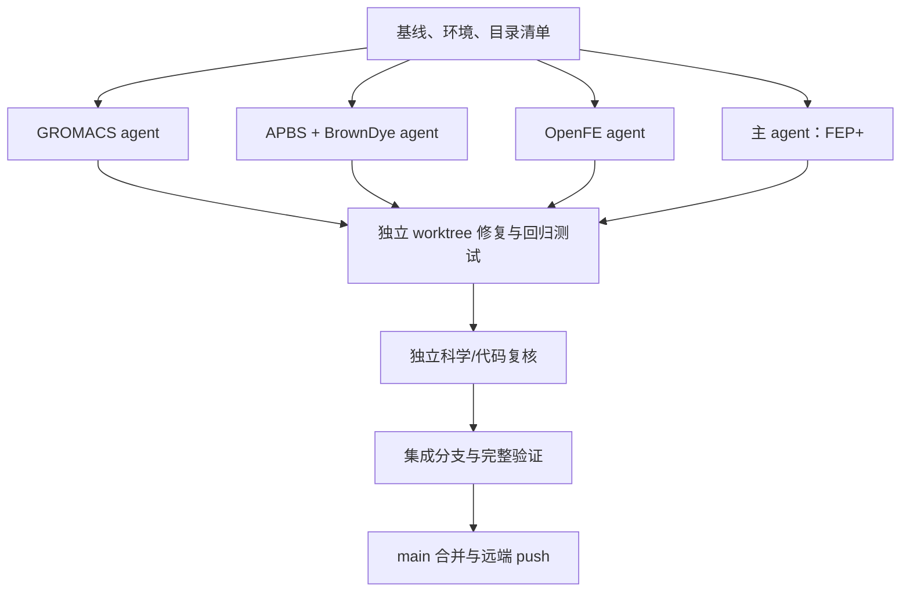

# examples/ 科学与代码审查报告

审查日期：2026-09-05。基线：`eecb097`。范围覆盖 `examples/` 的五类流程、15 个
notebook、直接调用的 preparation/analysis/plot helper，以及关联运行脚本。
本次重点是影响常规计算或科学解释的问题，不把极端输入防御、个人风格偏好或
尚无实际数据支持的假设列为已确认科学错误。

## 执行 DAG 与职责

每个 agent 独占一个 checkout。分支为 `science-review/gromacs`、
`science-review/electrostatics`、`science-review/openfe` 和
`science-review/fepp`，由主 agent 在 `science-review/integration` 汇总。
主 agent 独立检查其他分支的修改；OpenFE agent 另行复核 FEP+ 数学与总报告，
GROMACS agent 交叉复核 APBS/BrownDye。

| 分支 | 经验证的实现/审查 commits |
| --- | --- |
| `science-review/gromacs` | `1321806` |
| `science-review/electrostatics` | `9019522` |
| `science-review/openfe` | `c30128d`、`1305ca5` |
| `science-review/fepp` | `8444f8b` |

## 已确认问题及修复

| 范围 | 问题及一般性影响 | 修复 |
| --- | --- | --- |
| GROMACS / Ramachandran | 原来按数组列序号配对 φ、ψ。蛋白 termini 使两组角度对应不同残基，普通单链即可画出错误的联合分布。 | 特征标签保留原 topology residue index；只配对同一残基且同时存在的 φ、ψ，兼顾多链及 atom selection。 |
| GROMACS / hydrogen bonds | 自定义距离、角度只用于后处理；候选氢键已经被 MDTraj 默认阈值及 occupancy 过滤，放宽阈值不能找回被删掉的候选。 | 将用户阈值同时传入初始检测，统一检测和逐帧 presence 的几何定义；测试放宽阈值和收紧阈值后的 occupancy。 |
| GROMACS / RMSD→RMSF | MDTraj RMSD 会原地 center 输入轨迹，可能改变随后 RMSF/DCCM 使用的坐标及此前选定的 alignment。 | 在所选原子的副本上求 RMSD，保护调用者轨迹，并测试坐标及后续 RMSF 不变。 |
| GROMACS / PBC | 旋转拟合后的坐标继续与原 box vectors 一起用于 minimum-image geometry；notebook 和 shell 分析路径均存在该问题。 | Periodic contacts、hydrogen bonds 等使用未拟合轨迹；结构 fluctuation 使用独立的 fitted 轨迹；postprocessing 保留对应的 unfitted solute 文件。 |
| GROMACS / notebook API | 部分示例仍传入已删除的 `align=False`，另有 `auto_ticks(*axes)` 不符合绘图 helper 签名，常规执行直接报错。 | 更新为当前 API，并明确 RMSD 自身拟合与 RMSF 依赖预先 alignment 的区别；九个 notebook 用合成 periodic peptide 实际执行验证。 |
| GROMACS / hierarchical clustering | 接口允许将要求 Euclidean distance 的 Ward/centroid/median linkage 用于一般的 pair-fitted RMSD matrix，几何假设没有保证。 | 拒绝这三种不受支持的选择，保留 average/complete/single/weighted，并补回归测试。 |
| OpenFE / ligand chemistry | 真实输入 `ACCO_AMP` 在 `AssignBondOrdersFromTemplate` 后丢失指定 double-bond stereochemistry。 | `assign_topology` 保留 template stereochemistry、原重原子顺序与坐标；3D 与目标立体化学冲突时拒绝输入。 |
| OpenFE / cache | 单态和配对 notebook 共用目录，缓存只检查分子数量或文件存在；修改 pose/chemistry 后可能静默复用旧 charge、mapping 或 campaign。 | 分离 workflow workspace；以确切输入内容、设置和相关版本建立 charge/network/campaign 标识。 |
| APBS / 网格 | 原网格计数取整未遵守默认 multigrid 层级，APBS 可能自动减小点数，实际 mesh 比用户指定的更粗。 | 按默认四层所需的 `N=c*32+1` 向上取整；验证实际 `L/(N-1)` 不超过请求 spacing。 |
| APBS / GAFF2 | ligand 按 GAFF2 准备，但 `parmchk2` 未指定 GAFF2 参数集，补参阶段与准备/加载阶段不一致。 | 对应 notebook 使用 `parmchk2 -s 2`。 |
| APBS→BrownDye / protonation | notebook 的 pH/PROPKA 检查没有完整落实到最终 Amber 输入；去氢后，标准 residue names 不能保留已选的非默认 protonation 或 histidine tautomer。 | 显式应用所声明的 PROPKA 策略，并提供 Amber residue naming 输出，使 `tleap` 重建氢时保留所选状态。 |
| APBS→BrownDye / electrostatics | 两阶段 dielectric 不匹配，文档还误将 dielectric 解释为能量单位；Debye helper 只采用第一份日志，可能混合不一致的溶剂条件。 | 统一并记录 continuum settings；BrownDye 读取对应设置，核对两份日志的 Debye length，明确 dielectric 是无量纲 relative permittivity。 |
| APBS→BrownDye / 输入配套 | 重建 Amber PQR 后若 APBS 失败，旧 DX 仍可能与新电荷、radii 或坐标一起被 BrownDye 使用；symlink 还会让旧 preparation 随上游变化。 | 成功求解后共同发布该次 PQR、DX、log 和 settings；BrownDye 从已发布的一组文件建立本地 snapshot。 |
| BrownDye / trajectory export | notebook 使用的 `vtf_trajectory` CLI flags 与 BrownDye2 接口不符。 | 按 BrownDye2 的 stdin 接口转换已提取的轨迹。 |

φ 与 ψ 的正确配对分别是
`φ_i=(C_(i-1), N_i, CA_i, C_i)` 和
`ψ_i=(N_i, CA_i, C_i, N_(i+1))`。这也是为何按两组数组的第 k 列配对不成立。

PBC 问题来自坐标与晶格的关系：若行向量坐标旋转为 `xR`，晶格也应变为 `BR`。
仅旋转坐标后继续用 `B` 求 minimum image，一般不保持距离。
主 agent 用 box `(2,3,4)` nm、两原子 x 坐标 `0.1/1.9` nm 独立复现：正确距离为
`0.2` nm；坐标在 xy 平面旋转 90° 而 box 不变后，得到错误的 `1.2` nm。
此外，make-whole 只重建 bonded molecule；将各链重建为正确的多聚体仍须核查。

**FEP+ 未发现需要新增修复的常规数学或代码错误。** 已有实现正确处理 directed
edge signs、独立网络 gauge、完整 node covariance、paired double difference、
reference anchor 的 rank-one covariance 和 repeat heterogeneity。对该部分保留
原实现并记录证据，而非进行无必要重写。

## 最佳实践与科学边界

以下内容是解释或 protocol 改善，与上表已复现错误分开记录：

- OpenFE launcher 默认提供三次独立运行；notebook 的 `protocol_repeats=1` 与外部
  repeat 数量分别说明。Lambda replicas 和 resumed checkpoints 不能代替独立
  repeats。单次 MBAR uncertainty 仍有其含义，但不衡量 between-run variability。
- OpenFE 不再把较高 ligand asphericity 当作“结构解析更可靠”的证据，也不把相同
  pH 当作 receptor microstate 一定一致的保证。真实输入的 24 个
  ligand–conformation 组合通过化学、形式电荷及坐标保留检查。
- Dihedral PCA 使用常规的 centered sin/cos 表示，避免默认分别 z-score 改变圆周
  metric。不同体系比较应共享 basis；tICA 不应跨独立 trajectory 拼接边界构造
  lagged pairs，并应报告 stride 后的物理 lag time。
- FES 的 `-RT ln p(CV)` 解释要求对应 equilibrium ensemble。当前无 weights 的接口
  不能直接将 biased 或不同温度 replica 数据合并为目标态 FES。Histogram 光滑、
  RMSD plateau、cycle closure 均不能单独证明收敛。
- Radius of gyration 的 equal-atom 与 mass weighting 是不同 observable；当前 Python
  定义得到保留，并注明与 GROMACS 默认 mass weighting 的区别。移除 ligand 或其他
  分子后计算 SASA，得到的是相应选择的表面，不能当成它们仍在场时的表面。
- APBS potential map 和 log 中的 electrostatic energy 均不能直接解释为 binding
  free energy。BrownDye 的距离/contact 反应判据定义 encounter event；其速率不能
  自动等同实验 `k_on`，也没有描述 enzyme chemistry 或全部构象变化。
- Open/closed 的起始 PDB 不自动定义两个 thermodynamic basins。需要 receptor
  CV/occupancy 证据，或有物理依据的 state definition、restraints 及相应 corrections。
  不同 ligand 的 reference-relative selectivity 也不等于单个 ligand 的绝对
  open/closed preference；后者需要额外 thermodynamic anchor。
- Paired OpenFE 若使用同一个 solvent estimate，其误差在双差中相关并会抵消；若
  分别独立模拟，则按实际独立性传播误差。不能混淆这两种数据来源。

PROPKA、dielectric、radii、反应距离、缺失的 Mg/cofactor/结构水和 ligand pose 都有
体系依赖。此次没有凭空指定“唯一正确”值，也没有声称代码测试证明了实际采样充分。

方法核查使用原始研究与官方文档，包括
[alchemical free-energy best practices](https://doi.org/10.33011/livecoms.2.1.18378)、
[protein conformational restriction 的原始研究](https://pmc.ncbi.nlm.nih.gov/articles/PMC2562444/)，
以及各分报告列出的 MDTraj、GROMACS、APBS、Amber、BrownDye、OpenFE 和 RDKit 来源。
部分 vendor 行为还与本机安装的正式 release 源码核对；没有将 proprietary 源码复制进仓库。

## 验证与独立复核

| 集成检查 | 结果 |
| --- | --- |
| `conda run -n mdpp pytest -n 0` | **895 passed**，184.39 s；包括 GPU、slow、benchmark，无 deselection 或 skip。 |
| `conda run -n mdpp pre-commit run --all-files` | 全部通过：ruff、format、mypy、shellcheck、shfmt、JSON/YAML/TOML 等。 |
| 所有 notebook 的 nbformat schema 与 Python/Bash syntax | **15 个 notebook、127 个 code cells 通过**，无 schema warnings。 |
| 独立科学/代码复核 | 已识别的 HIGH/CRITICAL 均关闭；各分支和总报告均经过独立复核。 |

完整 pytest 有 **52 条 Python warnings**：4 条 sklearn HDBSCAN 的未来默认值提示，
24 条临时 PDB 缺少 unit-cell 信息和 24 条缺少 formal-charge 字段的提示。
这些 ligand 测试随后从权威 SMILES 恢复并核验精确化学身份/电荷。原始 stderr
另有 XLA driver-version 格式诊断、RDKit 预期非法输入/多重匹配提示和 MDTraj
退化测试几何诊断；测试进程 exit code 为 0，GPU agreement tests 均通过。
这不意味着生产轨迹或实验预测已经验证。

基线 CPU correctness suite：`693 passed`，完整 pre-commit 通过。
FEP+ 定向检查：12 个 ligand SDF 化学验证通过，42 项测试通过。
OpenFE 的共享 helper 修改由主 agent 独立检查，另用 24 个实际输入组合复验。
FEP+ 数学报告由 OpenFE agent 独立复核，无 HIGH/CRITICAL 问题。
GROMACS agent 对 electrostatics 进行了额外交叉复核；发现的 PQR/DX 配套问题
修复后再次检查，已关闭该 HIGH finding。OpenFE mapper cache 的残留问题也经
修复、针对性测试和主 agent 复核后关闭。

真实小规模外部工具检查：

- `GLH -> pdb4amber -y -> tleap ff19SB` 得到预期总电荷 `0.000000`，无警告/错误；
  该测试的 charged GLU 对照应为 `-1`。
- APBS 3.4.1 的单离子、`33×33×33` 网格完成计算并输出 DX。其 parser 仍打印
  `asc_getToken/Vio_scanf` warning，故不声称该外部检查无警告；详见分报告。
- BrownDye2 实际 `pqr2xml` 和 stdin `vtf_trajectory` 生成两个有效 VTF frames。
- 主 agent 另外检查 APBS 的 ligand PDB 与 complex 中的 ligand：均为 38 个重原子，
  新的共享 helper 保留精确化学身份与 `-1` 形式电荷。

运行环境沿用 `mdpp` conda，没有建立 `.venv` 或升级依赖。
Python 3.13.12、NumPy 2.4.4、SciPy 1.17.1、RDKit 2026.3.1、
MDTraj 1.11.1.post1、MDAnalysis 2.10.0、OpenMM 8.4.0。
GPU 测试按项目约束串行执行，避免多个 CUDA contexts 的并发资源干扰。

## 分报告与未验证内容

- [GROMACS：证据、方法与回归测试](2026-09-05-gromacs.md)
- [APBS/BrownDye：准备链、单位和外部工具检查](2026-09-05-electrostatics.md)
- [OpenFE：化学、cache、采样与解释](2026-09-05-openfe.md)
- [FEP+：数学、输入和无新增错误的证据](2026-09-05-fepp.md)

没有启动新的生产 MD、RBFE 或 BrownDye campaign，也没有修改 `results/`。
GROMACS 示范依赖用户轨迹路径，FEP+ 仓库没有完成的 production FMP；因此完整
notebook 的真实科学产出、long-timescale convergence、实验 affinity/kinetics 一致性
仍不能由此次审查宣告通过。OpenFE 旧 notebook outputs 已清除，避免把旧准备链的
显示内容当作新流程的计算结果。
